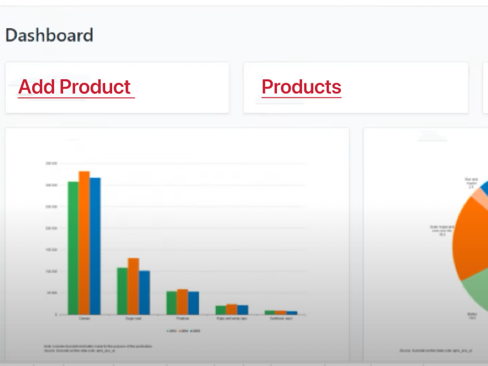

# This is management system application for management products and user information.

- Customers can add products to the cart and the total price can change consistently.
- Manager(Admin) can list products and remove products, also remove users.

## I created three folds. One for server, which connects MongoDB, another two are Client and Admin, Admin is similar to client but different functiona.

## How to deploy?

1. Download zip to local
2. Go to server fold

- npm install
- create .env
- PORT = 5000
  NODE_ENV = development
  JWT_SECRET = 123456
  MONGO_URL =
- Create databse from MongoDB
- Run local Postman to Post products and users
- Can check products and users from mangodbb database collections
- npm run server

3. Go to client fold

- npm install
- npm start
- Login(email: user@example.com pw:123456)

4. Go to admin fold

- npm install
- npm start
  -Login(email:admin@example.com pw:123456)

5. Deploy
- Go to heroku.com sign up for free acount
-  Create new APP, add list of "Config Vars"
- Install the Heroku CLI locally
- Go to server fold.Run 'heroku login'
- run "git init'
- run ' heroku git:remote -a shop-server-new'
- run 'git add .'
- run 'git commit -am "make it better"
- run 'git push heroku master'
- go to client fold do same way as server fold
- change .env file URL to https://xxxxxx.herokuapp.com under client fold
- go to admin fold do same way as server fold
- Open App by click the link

6. heroku.com  no longer provide free deployment, so my app is not run online. You can git clone and run localy.

7. Demo
- 
- 
- 
- 

